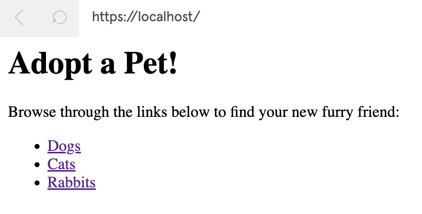
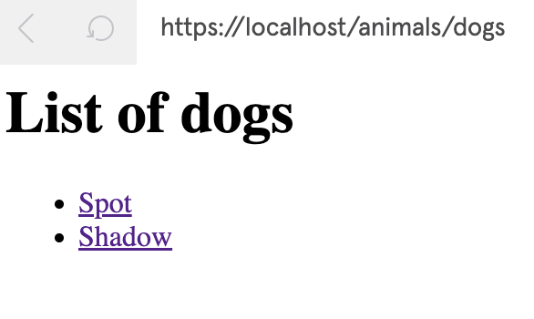
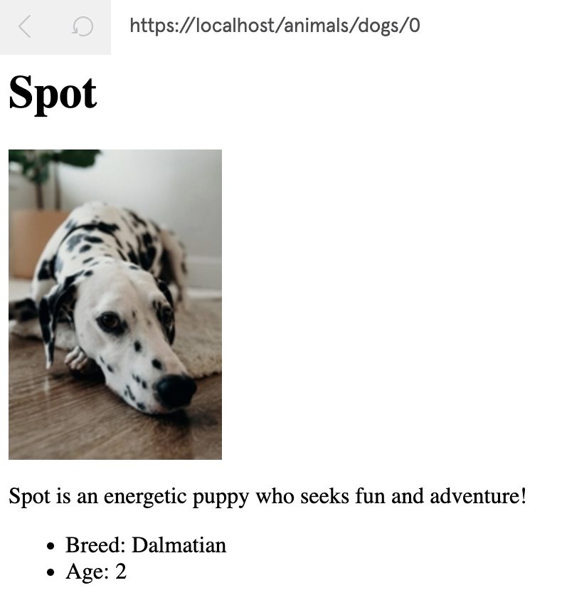
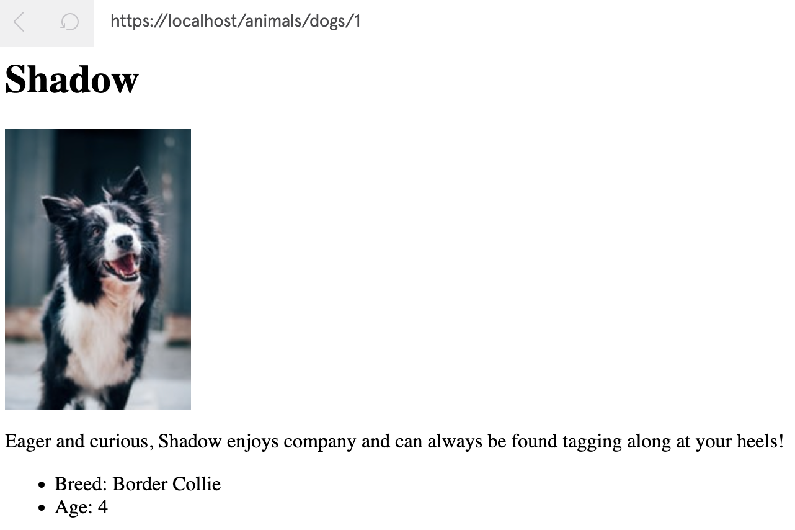

# Intro to Flask
Codecademy Notes (https://www.codecademy.com/learn/learn-flask)

Learning the basics

----

## Intro to Web Apps with Flask
Flask is a Python web micro-framework. In this course, we'll create fully-featured web apps with Flask.

----

## What is the back-end?
### Storing Data
The back-ends of websites typically include a database to store information. Relational databases store info in tables. Non-relational aka NoSQL databases use other systems like key-value pairs or a document storage model. SQL (Structured Query Language) is a programming language for relational databases. Examples of relational databases are MySQL & Postgres. Examples of NoSQL databases are MongoDB & Redis.

The back-end needs the ability to access, change, and analyze database data

### What's an API?
API stands for Application Program Interface. To have consistent ways of interacting with data, a back-end can use a web API. 

A web API is a collection of predefined ways of interacting with a web application's data, often through a HTTP request-response cycle. Unlike the HTTP request from client to server when a url load, this type of request indicates how it would like to interact with a web app's data, and it receives some data back as a response.

Database  <——> Web API (CRUD)

CRUD — Create new data, read data, update data, delete data)

Some APIs are open to the public.

### Authorization & Authentication
Our server shall handle this.

**Authentication** is the process of validating the identity of a user. "Who is this? Is it really you?" One example is usernames/passwords as credentials stored in the back-ends database. We can also use external log-in resources such as logging in with Google.

**Authorization** dictates which users have access to which resources and actions. "What is this user allowed to see/do?" Think of admin-access vs. intern-access.

Our back-end needs Authentication & Authorization in our server-side logic to create *secure, personalized, & dynamic* content.

### Different Back-end Stacks
Various programming languages can make a back-end.
Many developers use frameworks as a collection of tools that shape the organization of our back-end. Examples are Express, Flask, Django, Spring, Ruby on Rails, etc.

The collection of technologies used to create the front-end and back-end is called the stack. Think of a *full-stack* developer.

The MEAN stack uses 
**M**ongoDB for the database
**E**xpress for the back-end
**A**ngular for the front-end
**N**ode

The LAMP stack uses
**L**inux
**A**pache
**M**ySQL
**P**HP

### Review
  * The front-end is HTML, CSS, JS, & static assets sent to a web browser
  * A web server is a process running on our computer that listens for incoming requests over the internet and sends back responses
  * Manipulating data (CRUD) 
  * Databases
  * The server-side of a web app, sometimes called the application server, handles important tasks such as authentication & authorization
  * The back-end of a web app often has a web API which helps interact with the app's database through HTTP requests and responses
  * The front-end and back-end together make the tech stack

Now we have a basic knowledge of server-side development and what the back-end is!

----

## HTTP Requests Article

Understanding how our browser interacts with the internet

The internet is made up of tons of resources (HTML, stylesheets, images, videos, scripts, etc) hosted on different servers. Our browser asks these servers for permission to the content through a request & response cycle.

### What is HTTP?

Hypertext Transfer Protocol. HTTP structures requests and responses over the internet from one point to another.

The transfer of resources uses TCP (Transmission Control Protocol). TCP manages the channel between our browser and the server. 

TCP manages internet connections in which devices communicate over the internet. HTTP is the command language that both devices must adhere to for the connection to work.

### HTTP & TCP: How it Works
When you type a web address into a browser, you're commanding the browser to open a TCP channel to the server that responds to that URL. URL stands for Uniform Resource Locator. A URL is kind of like your phone number, because it describes how to reach you.

In this example, our computer is the client.

Once the TCP connection is made, the client sends a HTTP GET request to the server to figure out what to display. The server then sends a response & closes the TCP connection. Other HTTP methods are POST, PUT, DELETE.

Our browser parses `http://google.com` into http and the url. HTTP is the protocol. The domain name in the URL is `google.com`. The browser asks the DNS (Domain Name Server) to return the IP address (Internet Protocol) associated with that URL.

The GET request contains the IP address of the host and optionally a data payload. 
```
GET / HTTP/1.1  
Host: www.codecademy.com
```

The / after GET specifies the path. The protocol is `HTTP/1.1`.

HTTP/1.1  vs.  HTTP/1.0
In 1.0, every resource request requires a different connection to the server. In 1.1, one connection is used more than once, so additional resources are retrieved even after the initial page delivery. 1.1 is much faster than 1.0.

Here's a sample of a response from the server
```
HTTP/1.1 200 OK  
Content-Type: text/html
```

This 'header' comes before the requested content.

The first line (`HTTP/1.1 200 OK`) is a confirmation that server understands the client wants to communicate which the HTTP/1.1 protocol. The HTTP status code shows the resource was found on the server. 

The second line (`Content-Type: text/html`) shows the type of content that will be sent to the client.

If the resource isn't found, the response will be `HTTP/1.1 404 NOT FOUND`. 


### An Analogy
This section dives into a town-themed analogy. Clients are in houses. Servers are the businesses. There's a really speedy mail service.

### What's HTTPS?

HTTP requests can be read by anyone at certain network points. This is bad for sensitive information. Many servers support HTTPS, which is HTTP Secure, which encrypts data. It's up to the businesses maintaining the servers to set this up. The business applies for HTTPS from an authority.


----

## Build Your First Flask App (Lesson)

```
from  flask  import  Flask

app = Flask(__name__)

@app.route('/')
def home():
    return  'Hello, World!'
```

`python3 app.py`
It's served on localhost:5000

Notes
```
// Create an instance of the Flask class
// Pass in the name of the application
// Use __name__ because we're working with a single module
app = Flask(__name__)
```

The value of `__name__` changes with context.
If script is ran from the terminal, `__name__` equals the string `__main__`
If script is being imported as a module into another Python script, `__name__` equals its filename.
We'll learn why it's useful to have certain code running only when the script is executed one way or another.

If we print `__name__` at the bottom of the file, the value is `__main__`

### Routing
Every time we visit a URL in our browser, it makes a request to the web server, which will then send back a response. In our Flask app, we can create **endpoints** to handle different requests differently. This is called **routing**.

To define a route, define a **view function** which is basically just a function. It processed the request & process. Use the `route()` decorator to bind a URL to the view function. The function will be called when the URL is visited.

The route decorator takes the URL path as a param, which is the part of the url that follows the domain name. The path must start with a `/`. Multiple urls can be bound to the same view function; just put one decorator right below the other.

```
from  flask  import  Flask

app = Flask(__name__)

@app.route('/')
@app.route('/home')
def home():
    return  'Hello, World!'

@app.route('/reporter')
def reporter():
    return  'Reporter Bio'
```

### Render HTML
A view function can also return HTML. Just put the HTML in a string. If the HTML is multiple lines, use triple quotes `''' ..... '''`

```
from  flask  import  Flask

app = Flask(__name__)

@app.route('/')
@app.route('/home')
def home():
    return  '<h1>Hello, World!</h1>'

@app.route('/reporter')
def reporter():
    return  '''
    <h2>Reporter Bio</h2>
    <a href='/'>Return to home page</a>
    '''
```

### Variable Rules
We've handled static URLs, but what if we want to handle constantly changing URLs (dynamic URLs).

Make any section of the path by indicating `<variable_name>`
These variables will be passed into the view function as arguments.

We can optionally enforce typing by using the syntax `<type:variable_name>`

The possible types for this
  * string (accepts any text without a slash) **THIS IS THE DEFAULT**
  * int (accepts positive integers)
  * float (accepts positive floats)
  * path (accepts a string but accepts slashes too)
  * uuid (UUID strings)

Codecademy instructions
> Update the  `reporter`  endpoint to handle requests from individual
> reporter pages whose URL path follows the pattern  `'/reporter/#'`.
> 
> Add a variable section called  `reporter_id`  to the URL passed to the
> `route()`  decorator. Use a converter to specify that the variable
> part must be a positive integer.

```
from  flask  import  Flask

app = Flask(__name__)

@app.route('/')
@app.route('/home')
def home():
    return  '<h1>Hello, World!</h1>'

@app.route('/reporter/<int:reporter_id>')
def reporter(reporter_id):
    return  f'''
    <h2>Reporter {reporter_id} Bio</h2>
    <a href="/">Return to home page</a>
    '''
```
### Review
Import Flask class to create an application object
Define routes for handling different URLs
Static vs. Dynamic URLs

Codecademy instructions

> Define a third view function called `article()` that is bound to the
> URL path `'/article'`. The function should return an `<a>` tag with
> the text `Return back to home page` that links to `"/"`.
> 
> Now, add a variable rule such that a URL whose path follows the
> pattern `'/article/X'` will trigger the `article()` function. Name the
> variable part `article_name`.
> 
> Update the  `article()`  function to take a parameter called 
> `article_name`. Since this value is the URL slug, assume 
> `article_name`  will be all lower-cased with hyphens separating each
> word. For example,  `article_name`  could look like this:
> 
> `ten-ducks-enter-local-pond`
> 
> In the function body, replace the hyphens with spaces and turn the
> text to title-case. Then, before the  `<a>`  element in the returned
> HTML, add a  `<h2>`  heading containing the formatted title. Check the
> hint for guidance on how to make these formatting changes.

```
from  flask  import  Flask

app = Flask(__name__)

@app.route('/')
@app.route('/home')
def home():
    return  '<h1>Hello, World!</h1>'

@app.route('/reporter/<int:reporter_id>')
def reporter(reporter_id):
    return  f'''
    <h2>Reporter {reporter_id} Bio</h2>
    <a href="/">Return to home page</a>
    '''

@app.route('/article/<article_name>')
def article(article_name):
    return  f'''
    <h2>{article_name.replace("-", " ").title()}</h2>
    <a href="/">Return back to home page</a>
    '''
```

----

## Build Your First Flask App (Quiz)

> Which of the following code will display  `305.65K`  on the webpage at
> the  `/convert/celsius_to_kelvin/32.5`  URL?

```
@app.route('/convert/celsius_to_kelvin/<float:celsius>')
def celsius_to_kelvin(celsius):
    return f'{celsius + 273.15}K'
```
---
> Complete the code to have the webpage display a greeting when the user
> visits port `5000` of the `localhost` during development.

```
@app.route('/')
def home():
    return 'Welcome!'
```
----
> Complete the code to create a Flask application object.

```
from  flask  import  Flask  
app = Flask(__name__)
```
----
> Which of these is NOT true about Flask?   * Flask is a Python
> framework for developing web applications.   * Flask can be run with
> any WSGI-compatible server.   * Flask comes with a database
> abstraction layer and form validation.   * Flask can be used to create
> static web pages.

`Flask comes with a database abstraction layer and form validation is NOT TRUE` Flask comes with minimal built-in features.

---
> What will be displayed on the webpage at the  `/`  URL?

```
@app.route('/')  
def home():  
    return  '<h1>My First Flask App</h1>'
```

The response will be `My First Flask App` in the h1 style

---

> Which of the following code will display `Posts tagged with X` when
> the user visits `/tagged/X`, where `X` could be any tag.

```
@app.route('/tagged/<tag_name>')
def tagged(tag_name):
    return f'Posts tagged with {tag_name}'
```
This option has a variable in the URL and passes it as an argument to the view function.

---

> What will be the result of the following code?

```
@app.route('/home')  
@app.route('/about')  
def greeting():  
    return  'Hello, World!'
```

My answer is `Hello, World! will be displayed on both paths '/home' and '/about'`

----

## Adopt a Pet (Project)

In this project, you’ll use Python’s Flask framework to create a simple pet adoption site that contains multiple routes.

Codecademy provides `helper.py` which contains a dictionary `pets` so that we can populate our webpages.

`pets` contains 3 elements — dogs, cats, rabbits.

Use `for idx, item in enumerate(iterable):
    # code goes here` to loop over pet **and** index

Source Code — [app.py](app.py)








